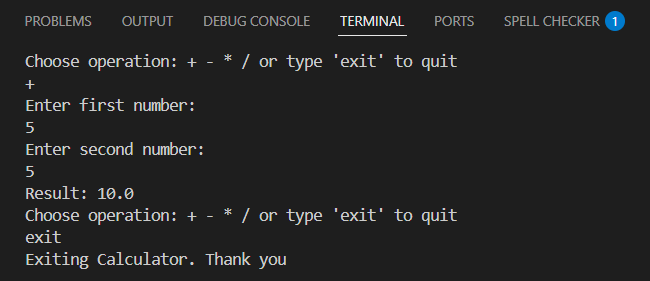

# Java CLI Calculator 🧮

This is a simple command-line calculator built using Java for a Java Developer Internship task.

## 💡 Features

- Supports basic operations:  
  ➕ Addition  
  ➖ Subtraction  
  ✖️ Multiplication  
  ➗ Division
- Input handling using `Scanner`
- Works in a loop until the user types `exit`
- Prevents division by zero

## 🧪 Sample Run

This is how the calculator looks in the terminal:

## 🧠 What I Learned

- Java syntax and structure  
- How to use `Scanner` for user input  
- Loop and switch-case for flow control  
- Method creation and usage in Java

## 📁 Project Structure

Java-CLI-Calculator/
│
├── Calculator.java      
├── README.md             
├── .gitignore          
├── LICENSE  

## 🔗 GitHub Repo

[Java-CLI-Calculator](https://github.com/khushbumaurya26/Java-CLI-Calculator)

## 🧑‍💻 Author

**Khushbu Maurya**  
Java Developer Intern candidate 💻
